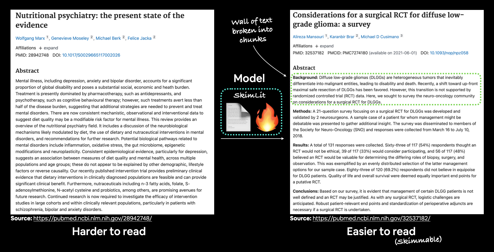
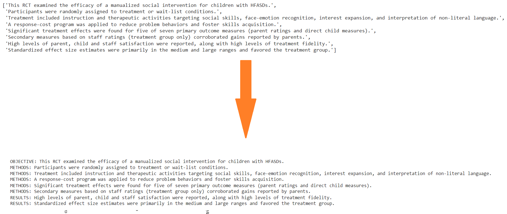

# SkimLit
The following is an implementation of the paper [*PubMed 200k RCT: a Dataset for Sequenctial Sentence Classification in Medical Abstracts*](https://arxiv.org/abs/1710.06071) in Tensorflow.

## Introduction
We're going to be replicating the deep learning model behind the 2017 paper PubMed 200k RCT: a Dataset for Sequenctial Sentence Classification in Medical Abstracts.
When it was released, the paper presented a new dataset called PubMed 200k RCT which consists of ~200,000 labelled Randomized Controlled Trial (RCT) abstracts.
The goal of the dataset was to explore the ability for NLP models to classify sentences which appear in sequential order.
In other words, given the abstract of a RCT, what role does each sentence serve in the abstract?

## Dataset
Access the dataset through Github ([PubMed RCT200k from GitHub](https://github.com/Franck-Dernoncourt/pubmed-rct))

## Model
We training a bunch of different model
1. baselinem model
2. custom_token_embed_conv1d model
3. pretrained_token_embed model
4. custom_char_embed_conv1d model
5. hybrid_char_token_embed model
6. tribrid_pos_char_token_embed model

### Covering the keypoint:
* Downloading a text dataset ([PubMed RCT200k from GitHub](https://github.com/Franck-Dernoncourt/pubmed-rct))
* Writing a preprocessing function to prepare our data for modelling
* Setting up a series of modelling experiments
  * Making a baseline (TF-IDF classifier)
  * Deep models with different combinations of: token embeddings, character embeddings, pretrained embeddings, positional embeddings
* Building our first multimodal model (taking multiple types of data inputs)
  * Replicating the model architecture from https://arxiv.org/abs/1612.05251
* Find the most wrong predictions
* Making predictions on PubMed abstracts from the wild

## Result & Inference

### Result
The best model performance is *tribrid_pos_char_token_embed* which get 83.20% acc,	0.830770 precision,	0.832020 recall,	0.831113 f1 score.
### Inference
The following table shows the inference from the model:

